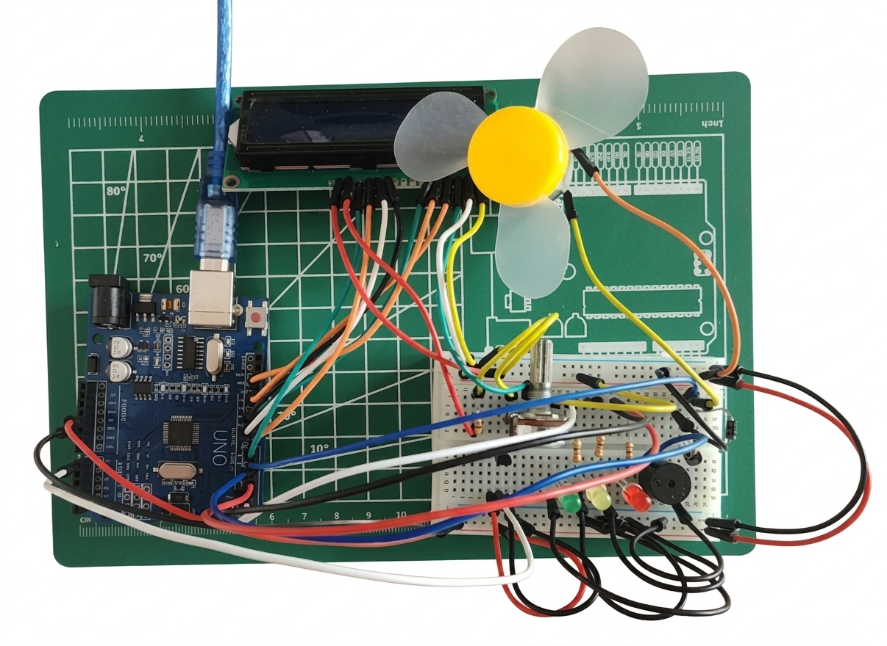
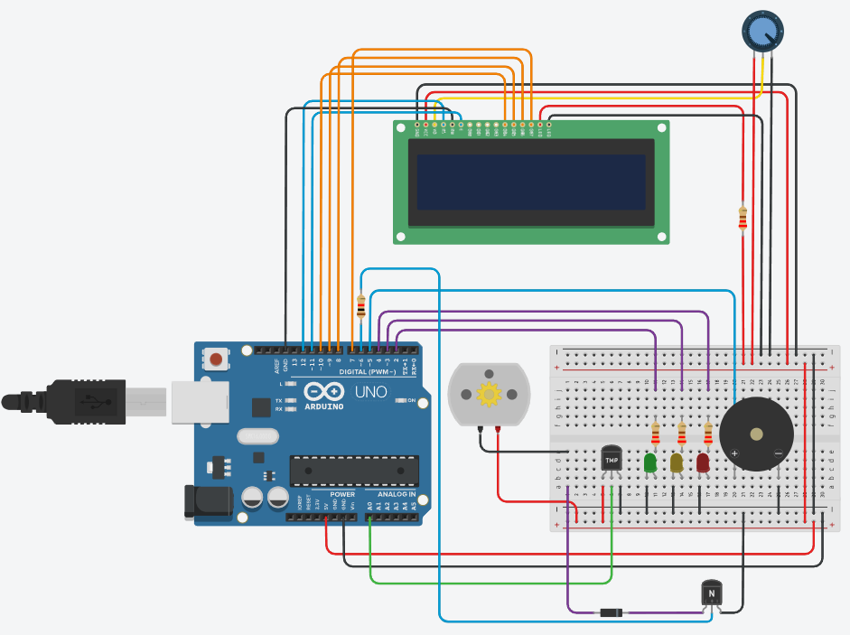
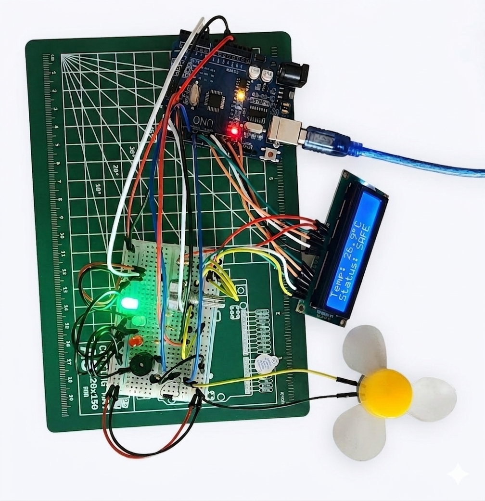
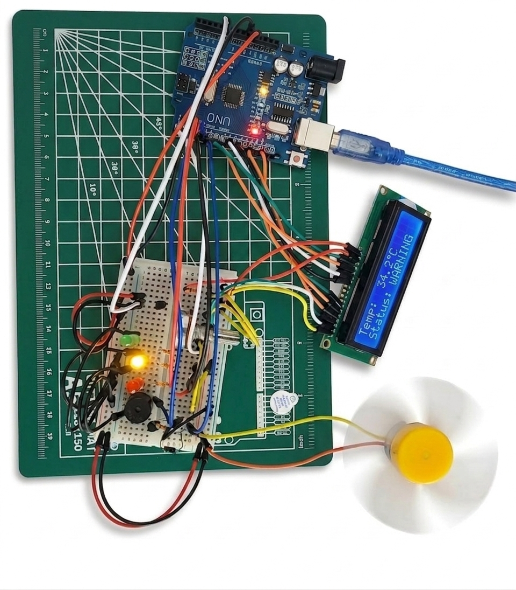
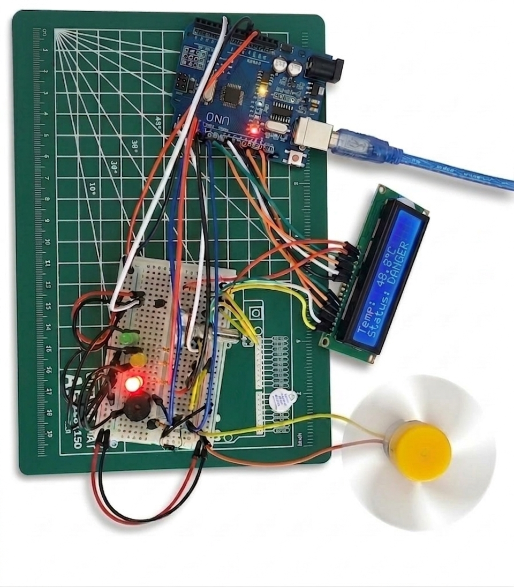
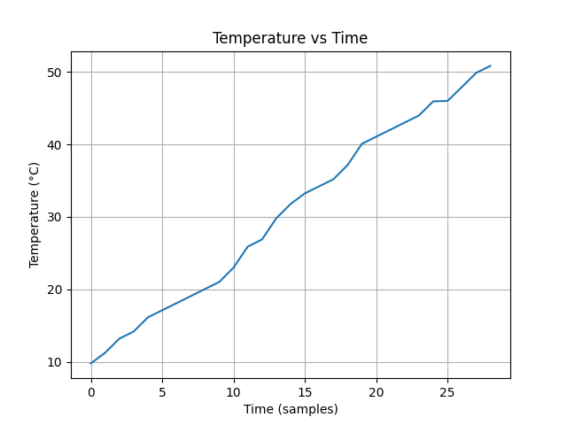
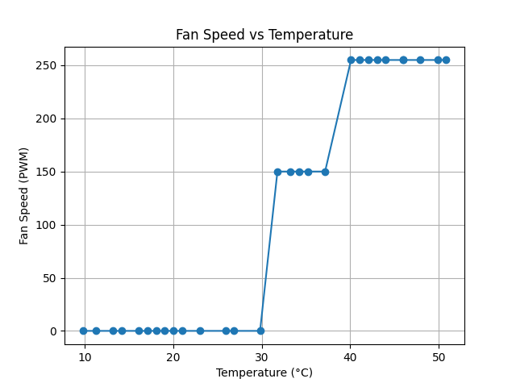

# 🌡️ Smart Temperature Monitoring and Fan Control System

A microcontroller-based temperature monitoring and cooling system using **Arduino Uno**, **LM35 temperature sensor**, **LCD display**, LEDs, buzzer, and a DC fan.

---

## 📌 Project Overview

This project automatically monitors temperature and controls a fan based on temperature levels.

It displays real-time temperature on a **16×2 LCD**, uses LEDs for status indication, and activates a buzzer during danger conditions.

The system was first simulated using **Tinkercad** and then implemented physically on a breadboard.

---

## ✨ Features

- 🌡️ Real-time temperature measurement using LM35
- 🖥️ Temperature display on 16×2 LCD
- 🟢 Green LED for safe temperature
- 🟡 Yellow LED for warning temperature
- 🔴 Red LED for danger temperature
- 💨 Automatic fan speed control using PWM
- 🔊 Buzzer alert for high temperature
- 🧪 Simulated in Tinkercad before physical implementation

---

## 🧰 Components Used

| Component | Quantity | Description |
|------------|:-------:|-------------|
| Arduino Uno | 1 | Main microcontroller |
| LM35 Sensor | 1 | Temperature sensor |
| LCD 16×2 | 1 | Display module |
| DC Motor / Fan | 1 | Cooling fan |
| 2N2222 Transistor | 1 | Motor driver |
| 1N4001 Diode | 1 | Back EMF protection |
| LEDs | 3 | Status indicators |
| Buzzer | 1 | Sound alert |
| 330Ω Resistors | 3 | LED current limiting |
| 1.2kΩ Resistor | 1 | Current limiting |
| 10kΩ Potentiometer | 1 | LCD contrast control |

---

## 🚦 System Logic

| Temperature | Status | Outputs |
|--------------|--------|---------|
| **Below 30°C** | 🟢 SAFE | Green LED ON • Fan OFF • Buzzer OFF |
| **30°C – 40°C** | 🟡 WARNING | Yellow LED ON • Fan LOW (PWM 150) • Buzzer Low |
| **Above 40°C** | 🔴 DANGER | Red LED ON • Fan HIGH (PWM 255) • Buzzer High |

---

## 🔌 Circuit Design

The system consists of the following modules:

- 🌡️ **LM35 Temperature Sensor** measures the ambient temperature.
- 🧠 **Arduino Uno** processes the sensor readings.
- 🖥️ **16×2 LCD** displays the current temperature and system status.
- 💨 **DC Fan** cools the system when required.
- ⚡ **2N2222 Transistor** safely drives the fan.
- 🛡️ **1N4001 Diode** protects the circuit from motor back EMF.
- 💡 **LEDs** indicate the current operating state.
- 🔊 **Buzzer** alerts the user when the temperature becomes dangerous.

---

## 💻 Arduino Code

```cpp
#include <LiquidCrystal.h>

LiquidCrystal lcd(12, 11, 10, 9, 8, 7);

const int tempPin = A0;
const int greenLED = 2;
const int yellowLED = 3;
const int redLED = 4;
const int buzzerPin = 5;
const int fanPin = 6;

void setup() {
  pinMode(greenLED, OUTPUT);
  pinMode(yellowLED, OUTPUT);
  pinMode(redLED, OUTPUT);
  pinMode(buzzerPin, OUTPUT);
  pinMode(fanPin, OUTPUT);

  lcd.begin(16, 2);
  lcd.print("Temp Control");
  delay(2000);
  lcd.clear();

  Serial.begin(9600);
}

void loop() {
  int sensorValue = analogRead(tempPin);
  float temperature = (sensorValue * (5.0 / 1023.0)) * 100.0;

  lcd.setCursor(0, 0);
  lcd.print("Temp: ");
  lcd.print(temperature, 1);
  lcd.print((char)223);
  lcd.print("C ");

  if (temperature < 30) {
    digitalWrite(greenLED, HIGH);
    digitalWrite(yellowLED, LOW);
    digitalWrite(redLED, LOW);
    digitalWrite(buzzerPin, LOW);
    analogWrite(fanPin, 0);
    lcd.setCursor(0, 1);
    lcd.print("Status: SAFE   ");
  }
  else if (temperature < 40) {
    digitalWrite(greenLED, LOW);
    digitalWrite(yellowLED, HIGH);
    digitalWrite(redLED, LOW);
    digitalWrite(buzzerPin, LOW);
    analogWrite(fanPin, 150);
    lcd.setCursor(0, 1);
    lcd.print("Status: WARNING");
  }
  else {
    digitalWrite(greenLED, LOW);
    digitalWrite(yellowLED, LOW);
    digitalWrite(redLED, HIGH);
    digitalWrite(buzzerPin, HIGH);
    analogWrite(fanPin, 255);
    lcd.setCursor(0, 1);
    lcd.print("Status: DANGER ");
  }

  delay(500);
}
```

---

## 🧪 Simulation

The system was first designed and tested in **Tinkercad** to verify the circuit operation before purchasing components and building the physical prototype.

🔗 View the project on **[Tinkercad](https://www.tinkercad.com/things/f8T5LlI4fx2-lcd-screenfan-finaldraft?sharecode=5brvruFZ7L8Hl2oCXlwgCmE1TAaNpYBg8vopqqMrVao)**.
---

## 📸 Project Gallery

### 🔌 Real Circuit



---

### 💻 Tinkercad Simulation



---

### 🟢 Safe Mode



---

### 🟡 Warning Mode



---

### 🔴 Danger Mode



---

### 📈 Temperature vs Time



---

### 📊 Fan Speed vs Temperature



---

## 📊 Results

The project successfully demonstrated:

- ✅ Real-time temperature monitoring
- 🌡️ Accurate temperature measurement using the LM35 sensor
- 🖥️ Live temperature display on the LCD
- 💡 Automatic LED status indication
- 💨 PWM-based automatic fan speed control
- 🔊 Audible warning using the buzzer
- 🧪 Successful simulation in Tinkercad
- 🔧 Successful real-life hardware implementation

---

## 🚀 Future Improvements

Possible future enhancements include:

- 📱 Mobile app monitoring
- ☁️ IoT cloud integration
- 📶 Wi-Fi notifications
- 📈 Data logging and graph generation
- 🌍 Smart home integration
- ❄️ Automatic air conditioning control

---

## 📚 References

- Arduino IDE Documentation
- Tinkercad Official Website
- LM35 Temperature Sensor Datasheet
- 2N2222 Transistor Datasheet
- 1N4001 Diode Datasheet

---

## 👨‍🎓 Author

**Abdulmajeed Hartani**

🎓 Istanbul Aydin University

📖 COM382 – Microprocessors

📅 Spring Semester 2025–2026

---

## ⭐ Support

If you found this project helpful or interesting, consider giving it a ⭐ on GitHub!
